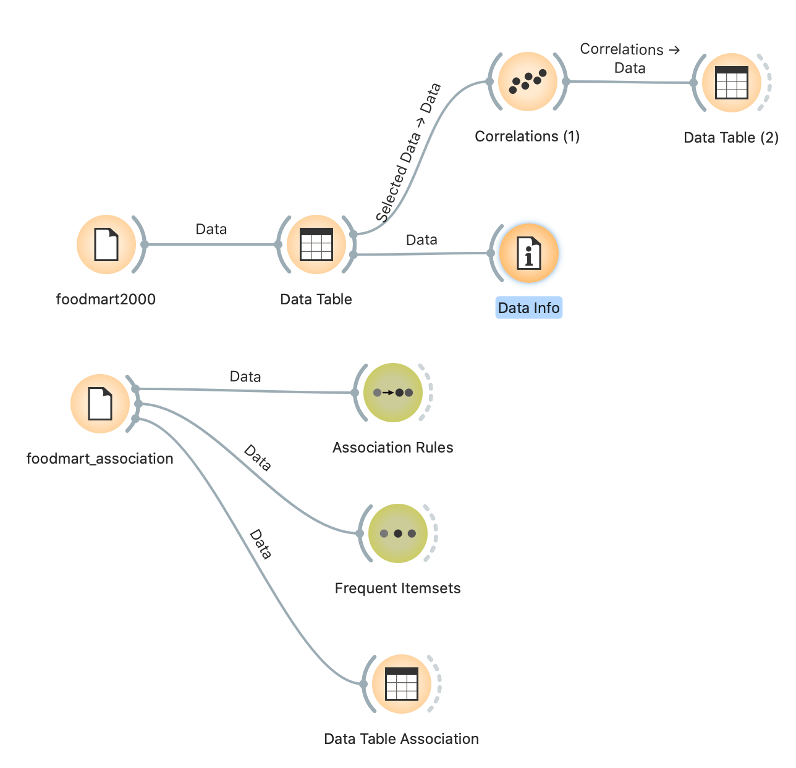
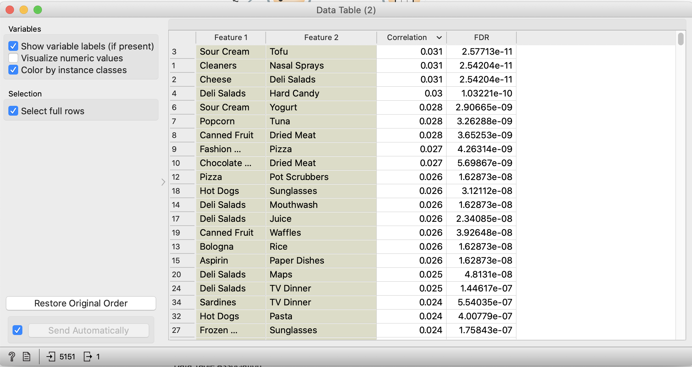
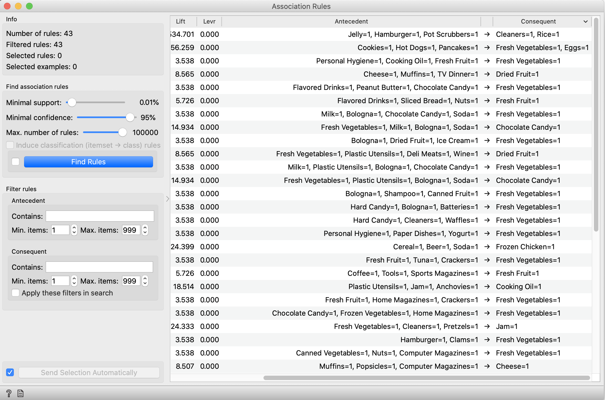
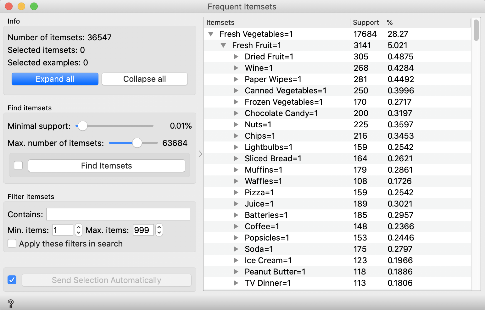
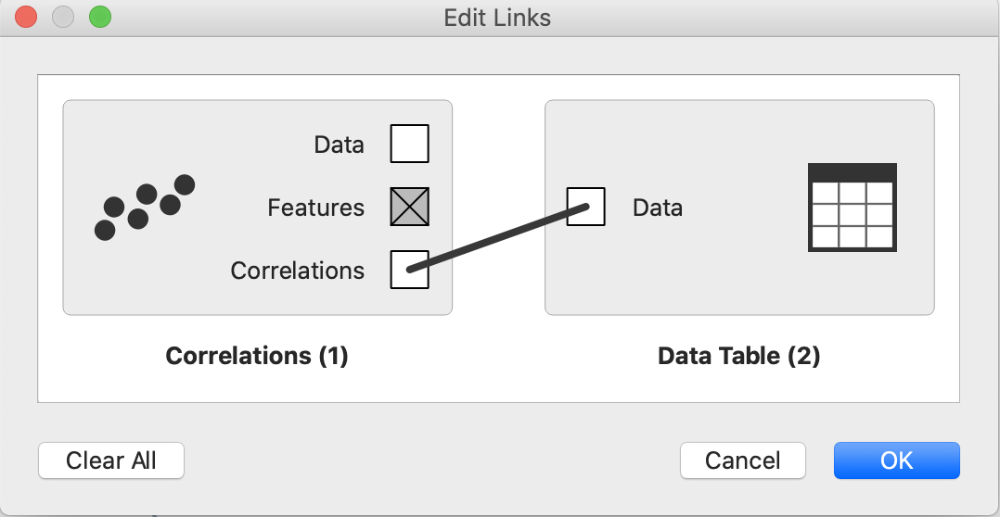
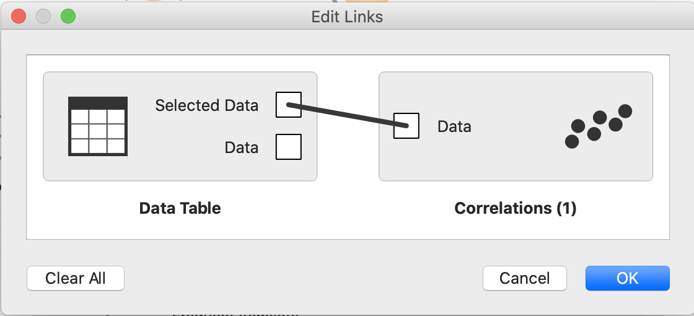
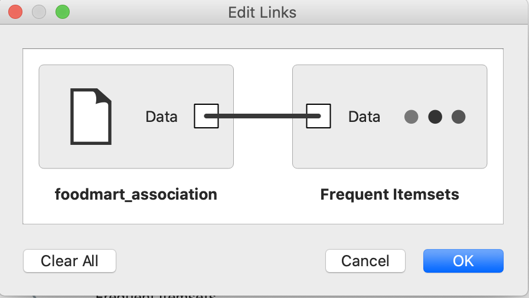

## Projeto Orange / Regras de Associação para Foodmart

Para a realização desse exercício considerou-se duas abordagens.

1. Explorar o arquivo foodmart2000.csv, contendo todas as compras realizadas no mercado
2. Explorar o arquivo foodmart2000-association.csv que continha a informação de quais
   produtos haviam sido adquiridos em uma mesma compra.

### Imagens comentadas do projeto

A partir do arquivo foodmart2000, utilizando o component "File" vemos uma associação com o Componente 
"DataTable" e a partir dele a utilização do component "Correlations". Este último componente busca identificar
uma correlação entre oos produtos na base de compra. 
Idealmente, produtos com um maior grau de correlação (com um menor FDR) representam os que tem maior
chance de estarem juntos em um processo de compra.

No entanto, esse processo não leva em contra as possíveis combinações de produtos.
Dessa forma, utilizou-se o arquivo foodmart_associations.csv, como visto no diagrama acima, para
buscar entender as relações entre os produtos adquiridos. Dessa forma, utilizou-se 2 componentes
capazes de buscar tais associações:

* Association Rules
  Esse componente recebe um conjunto de dados e busca encontrar associações entre eles.
  Para esse dataset, o valor mínimo para o suporte em todas as combinações foi considerado
  0.01% e a confiança no mesmo, de 95%. Segue abaixo o resultado observado:
  

* Frequent Itemset
  Buscando entender como os conjuntos poderiam se organizar de forma hierárquica, ultimou-se esse componente
  para identificar não apenas as relações mais comuns, mas ter uma visão de como os itens se relacionavam em
  um conjunto. Este foi o resultado observado:
  

  Veja que vários dos subitems indicam um percentual < 1, o que nos leva a considerar que o "Minimal support" a
  ser considerado possa ser aumentado, buscando correções que indiquem um maior grau de sucesso na 
  aquisição de um mesmo produto.

### Conclusões - foodmart2000

Do ponto de vista da abordagem arquitetural do Orange, vemos algo como o estilo arquitetural DataFlow com a
implementação de processos no estilo Pipe & Filter, onde os "Pipes" apresentam também especializações, 
dependo de seus conectores, como podemos ver nas conexões abaixo.

* "Pipe" do componente "Correlations" para o componente "Data Table"

  

* "Pipe" do componente "Data Table" para o componente "Correlations"

  

* "Pipe" mais genérico utilizado em diversas "comunicações" entre componentes

  

Do ponto de vista da utilização dessas informações para um gui de sugestões, a utilização de uma associação por 
items combinada com as informações presentes na saída do componente "Frequent Intemsets" é um instrumento
poderoso para sugerir ao usuário itens que apresentam forte correlação entre si, considerando a base de informações
do sistema.
Através do output do componente "Association" é possível verificar combinações prováveis dado os produtos
atualmente selecionados e com a informação da saída do "Frequent Itemset" é possível verificar dentro dessas
combinações, quais os elementos mais "relevantes".