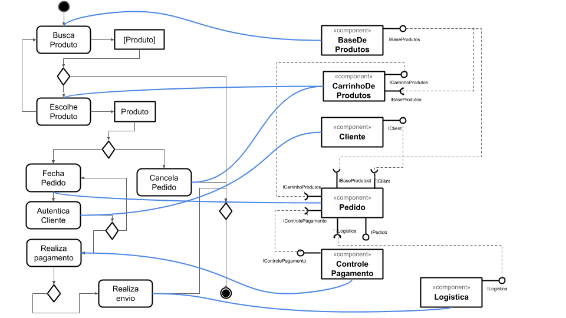
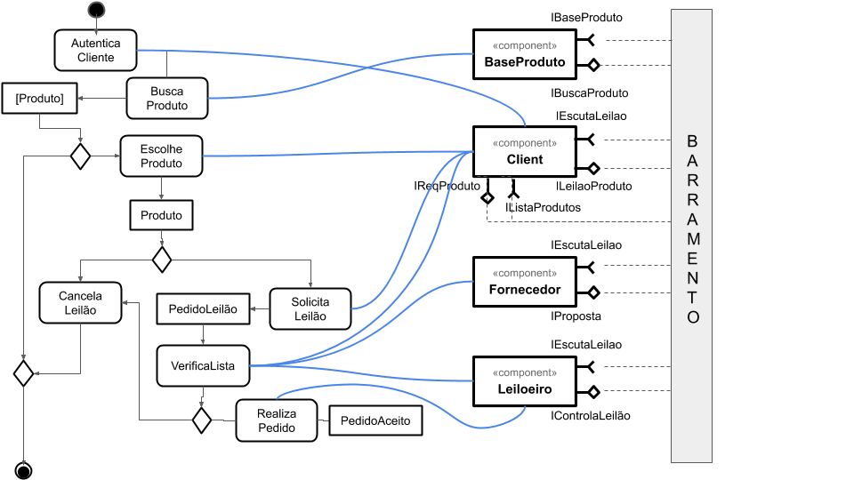

# Items para o Lab 3

Este lab é formado por um conjunto de atividades que serão detalhadas abaixo

## Tarefa 1

## Tarefa 2

## Tarefa 3

## Tarefa 4

Está foi desenvolvida em grupo pela Equipe 6, composta pelos seguintes membros:
- Agner Esteves Ballejo 
- Ian Poli Tavares 
- José Eduardo Porte
- Mateus Gonçalves Geracino 
- Marcos Vinícius Piaia 
- Tatiany Fermino Rodrigues de Oliveira

Este é o [link](https://github.com/inf331equipe6/tarefas) para o repositório. A resposta para esta tarefa encontra-se na pasta lib03.