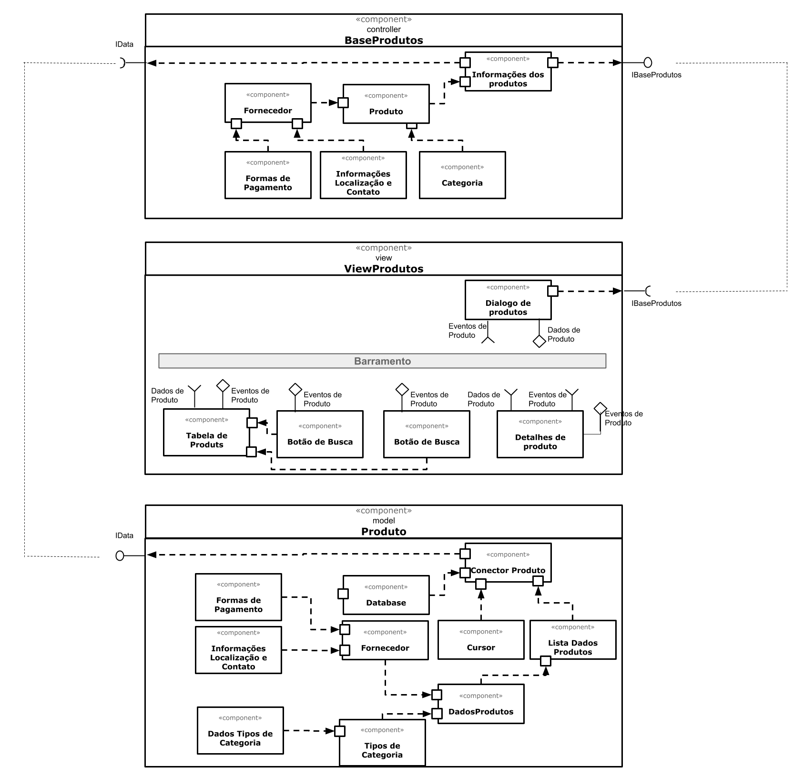

# Items para o Lab 5

Este lab é formado por um conjunto de atividades que serão detalhadas abaixo

## Tarefa 1



## Tarefa 2

#### HTML

```html
<div id="root"></div> 
```

#### JavaScript

```javascript
class Barra extends React.Component {
  render() {
    let resultado = "";
    for (let b = 1; b <= this.props.tamanho; b++)
      resultado += "=";
    return resultado;
  }
}

class Titulo extends React.Component {
  render() {
    const hStyle = { color: 'red' };
    const element = <h1 style={ hStyle }>O Dinossauro</h1>
    return element
  }  
  
}

class Acao extends React.Component {
  
  render() {
    const actionList = ['pulou na lama',
                      'caiu na lama',
                      'conheceu uma lhama'];    
    const actionValue = actionList[Math.floor(Math.random()*actionList.length)];
    const hStyle = { color: 'blue' };
    const element = <h1 style={ hStyle }>{ actionValue }</h1>
    return element
  }  
  
}


const elemento = <div>
                   <Titulo/>
                   <Barra tamanho="10"/>
                   <Acao/>
                 </div>
ReactDOM.render(elemento, 
        document.getElementById("root"));

```


